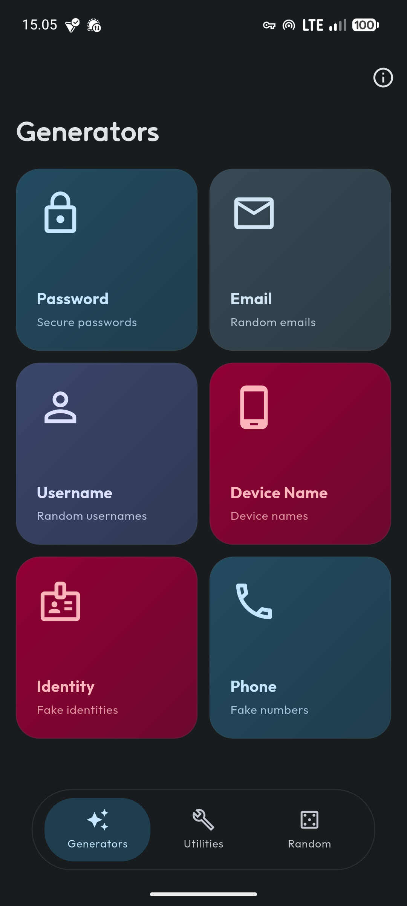
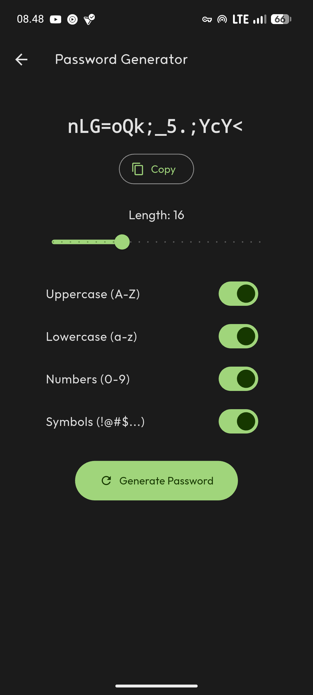
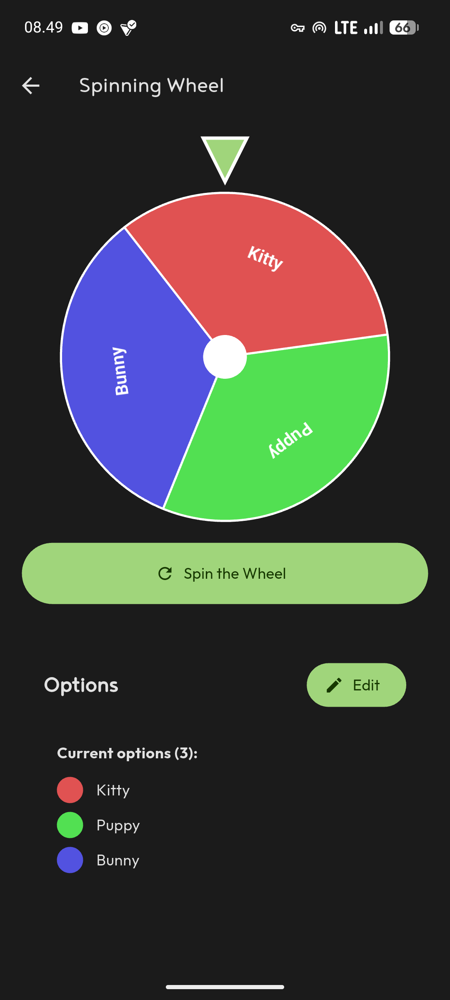

**[Random](https://github.com/felle-dev/random-app)**
*A versatile utility app for generating passwords, rolling dice, flipping coins, and more—built with Flutter.*

[](https://github.com/felle-dev/random-app/releases)
[](https://flutter.dev)
[](LICENSE)

[](https://github.com/felle-dev/random-app/releases)

## **Features**
- **Password Generator** – Create strong, customizable passwords instantly
- **Dice Roller** – Roll virtual dice for games or decisions
- **Coin Flip** – Quickly flip a coin for random choices
- **Simple & Intuitive** – Clean UI for effortless use
- **Offline-First** – No internet required; your data stays private

## **Screenshots**
<div style="display: flex; justify-content: space-around; gap: 10px;">
  
  
  
</div>

## **Tech Stack**
- **Language:** Dart
- **Framework:** Flutter
- **UI:** Material Design 3

## **Getting Started**

### **Prerequisites**
- [Flutter SDK](https://flutter.dev/docs/get-started/install) (latest stable version)
- Android Studio / VS Code with Flutter extensions
- Android/iOS device or emulator

### **Installation**
1. Clone the repository:
   ```bash
   git clone https://github.com/felle-dev/random-app.git
   cd random-app
   ```
2. Install dependencies:
   ```bash
   flutter pub get
   ```
3. Run the app:
   ```bash
   flutter run
   ```

## **Contributing**
Open-source thrives on collaboration! You can:
- Fork the project and submit pull requests
- Report bugs or suggest features via [issues](https://github.com/felle-dev/random-app/issues)
- Share feedback or ideas

## **License**
This project is licensed under the **GNU General Public License v3.0**. See [LICENSE](LICENSE) for more details.


[release-badge]: https://img.shields.io/github/v/release/felle-dev/random-app?style=for-the-badge
[flutter-badge]: https://img.shields.io/badge/Flutter-02569B?style=for-the-badge&logo=flutter&logoColor=white
[license-badge]: https://img.shields.io/github/license/felle-dev/random-app?style=for-the-badge
